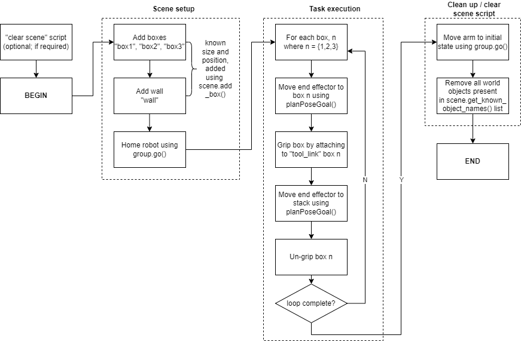

# Niryo-One-Robot-Arm-Simulation
❗ Disclaimer: this code was submitted as part of my assessed work required to pass my ELE3005M Robotics and Automation university module. It represents origional work and may include additions added by my project group members; I therefore cannot claim to be the sole author of this work (although to be honest I was the main contributer :/).


## Brief description
ROS and the MoveIt python wrapper were utilised to execute a simple box stacking task in simulation, visualised in rviz. The task is to pick up a set of boxes and place them in a stack on the other side of a barrier. 

## Environment setup and dependencies
All of the code provided was run on [The Construct](https://www.theconstructsim.com/), an online ROS educational platform which offers a remotely accessable Ubuntu VM in which ROS projects can be created and run within a safe, albeit computationally limited, environment. These are not all of the files required to run the simulation; importantly, the [Niryo One ROS stack](https://github.com/NiryoRobotics/niryo_one_ros) needs to be installed which allows for the Niryo One robotic arm to be used in simulation by calling 
```
roslaunch niryo_one_bringup desktop_rviz_simulation.launch
```
which launches the rviz gui. After adding the *PlanningScene* visualisation in order for objects to be displayed, the main task script can be called in a new terminal via
```
cd ~/catkin_ws/src/stacking_task/scripts/
python stackingTask.py
```
making sure that the script is executable by using the ``` chmod +x <file name here>``` command. Any dependencies required by the MoveIt Move Group Python Interface also need to be installed, alongside any libraries called by the script. The following lines were appended to the end of .bashrc as part of the environment setup procedure, in order to forgo manually calling the commands in future:
```
source /opt/ros/kinetic/setup.bash
source ~/catkin_ws/devel/setup.bash
```

## Methodology
As mentioned above, the scripts uses the MoveIt Move Group Python Interface and is loosely based off of [this tutorial](http://docs.ros.org/en/kinetic/api/moveit_tutorials/html/doc/move_group_python_interface/move_group_python_interface_tutorial.html). The program layout/process is simple, and is represented in the following flow chart:



## Results
The stacking task is acheived as expected using the hardcoded scene layout and stacking locations. The solution to the task is, at this stage, basic. It can definately be improved and more features can be implimeted; these areas are touched upon in the [video demenstration](./images_and_videos/demo_video.m4v).
